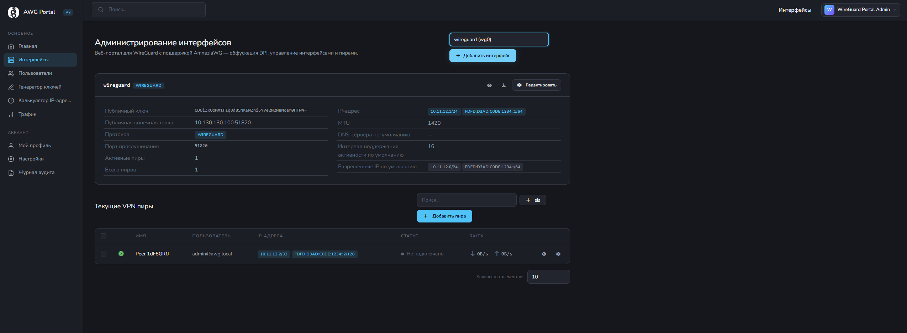
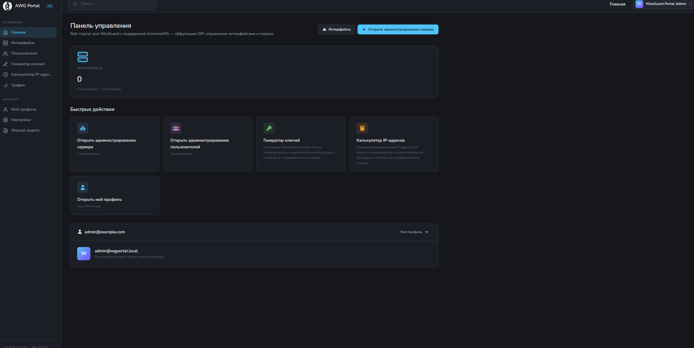
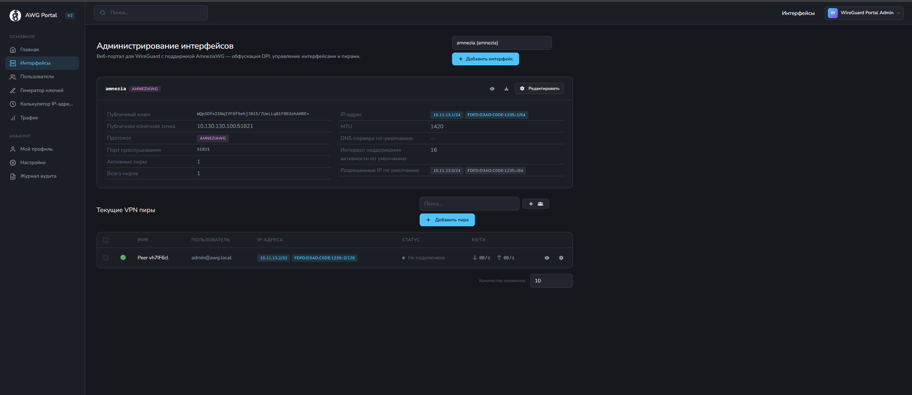

# AWG-PORTAL

[](https://opensource.org/licenses/MIT)

[](https://goreportcard.com/report/github.com/DanilenkA/awg-portal)


## Screenshots

<p align="center">
  
  
</p>
<p align="center">
  
  
</p>

## Introduction

**AWG-PORTAL** (v2.0) — это форк [h44z/wg-portal](https://github.com/h44z/wg-portal) с полной поддержкой [AmneziaWG](https://github.com/amnezia-vpn/amneziawg-go) — протокола, устойчивого к DPI и блокировкам.

Портал предоставляет веб-интерфейс для управления VPN-серверами на базе **WireGuard** и **AmneziaWG**. Поддерживает создание/удаление пиров, генерацию конфигов, мониторинг трафика, глобальную мультиязычность и REST API.

Обфускация AmneziaWG настраивается через веб-интерфейс для каждого интерфейса отдельно — параметры автоматически передаются в конфигурации клиентов.

## Возможности

* Полная поддержка **WireGuard** и **AmneziaWG** (amneziawg-go v2.x / awg)
* Обфускация трафика — защита от DPI (Deep Packet Inspection)
* Автовыбор AWG-параметров с возможностью ручной настройки
* **UI/UX v2:** адаптивный дизайн с тёмной темой, сайдбар с 3 брейкпоинтами (широкий / компактный / мобильный drawer)
* **Мультиязычность (11 языков):** en, ru, de, fr, es, pt, uk, vi, ja, zh, ko
* **Мониторинг трафика:** 30s polling, табло всех пиров с счётчиками за сессию
* **Статус AWG-пиров:** handshake, connected, traffic counters (чтение через UAPI-сокет)
* Самодостаточный бинарник — всё в одном файле
* Автовыбор IP из пула сети при создании пира
* QR-код для удобной настройки мобильных клиентов
* Отправка конфига по email
* Включение / отключение пиров без прерывания соединений
* Генерация wg-quick/awg-quick конфигов (`wgX.conf`)
* Аутентификация (БД, OAuth, LDAP), поддержка Passkey
* IPv6 готовность
* Docker-ready
* Работа с существующими WireGuard-интерфейсами
* Поддержка нескольких интерфейсов и бекендов (wgctl, MikroTik, pfSense)
* Управление маршрутизацией и DNS (как wg-quick)
* Prometheus-метрики для мониторинга
* REST API для управления и деплоя клиентов
* Webhook для кастомных действий

## Отличия от оригинала (h44z/wg-portal)

| Возможность | h44z/wg-portal | AWG-PORTAL |
|---|---|---|
| WireGuard | ✅ | ✅ |
| AmneziaWG (обфускация) | ❌ | ✅ |
| amneziawg-go | ❌ | ✅ (v2.x) |
| AWG-параметры в API | ❌ | ✅ |
| UAPI для AWG | ❌ | ✅ |
| Статус AWG-пиров (handshake/traffic) | ❌ | ✅ |
| UI/UX v2 (адаптивный, тёмная тема) | ❌ | ✅ |
| Мультиязычность (11 языков) | ❌ | ✅ |
| Трафик-мониторинг (/traffic dashboard) | ❌ | ✅ |
| AWG-бейдж в интерфейсе | ❌ | ✅ |
| SVG-логотип | ❌ | ✅ |
| PresharedKey/PrivateKey автогенерация в API | ❌ | ✅ |

## Быстрый старт

### Docker (рекомендовано)

```bash
# 1. Скачать docker-compose.yml
curl -LO https://raw.githubusercontent.com/DanilenkA/awg-portal/main/docker-compose.yml

# 2. Отредактировать docker-compose.yml - поменять:
#    - WG_PORTAL_CORE_ADMIN_USER
#    - WG_PORTAL_CORE_ADMIN_PASSWORD
#    - WG_PORTAL_WEB_EXTERNAL_URL

# 3. Создать директории для данных
mkdir -p data config

# 4. Запустить
docker compose up -d

# 5. Открыть браузер: http://<сервер>:8888
```

Контейнер использует `network_mode: host` — портал управляет сетевыми интерфейсами непосредственно на хосте. Все порты (8888, 8787, 51820+) открываются на хосте.

### Бинарный релиз (рекомендовано)

```bash
# 1. Скачать бандл (последняя версия)
curl -LO https://github.com/DanilenkA/awg-portal/releases/latest/download/awg-portal-v2.0.0-bundle.tar.gz

# 2. Распаковать
mkdir awg-portal && cd awg-portal
tar xzf ../awg-portal-v2.0.0-bundle.tar.gz --strip-components=1

# 3. Запустить установку (автовыбор архитектуры)
sudo bash install.sh

# 4. Настроить конфиг и запустить
sudo nano /opt/awg-portal/config.yml
sudo systemctl enable --now awg-portal
```

В бандле (`awg-portal-v2.0.0/`):
- `bin/wg-portal-amd64` — основной бинарник (есть также `wg-portal-arm64` и `wg-portal-arm`)
- `bin/amneziawg-go` — userspace AmneziaWG (для обфускации)
- `config.yml.sample` — образец конфига
- `install.sh` — скрипт установки systemd-юнита (с поддержкой всех вариантов бандла)

Скрипт устанавливает основной бинарник в `/usr/local/bin/awg-portal`,
создаёт `/opt/awg-portal/data` и `/opt/awg-portal/config`, а systemd-юнит
запускает портал с `WG_PORTAL_CONFIG=/opt/awg-portal/config.yml`.
`amneziawg-go` устанавливается в `/usr/local/bin/amneziawg-go`.
Юнит также задаёт `RuntimeDirectory=amneziawg`: systemd создаёт
`/run/amneziawg` для UAPI-сокетов AWG при старте сервиса.
> **Примечание:** В бандлах до v1.4.0 включительно install.sh мог лежать
> в `deploy/install.sh` рядом с бинарниками в корне архива. Скрипт
> `install.sh` умеет находить бинарники во всех вариантах раскладки
> (`bin/`, `dist/`, плоский корень), поэтому работает одинаково независимо
> от того, в `deploy/` он или в корне бандла.

### Ручной запуск (без установки)

```bash
# Конфигурация через переменные окружения (флаг --config НЕ поддерживается)
export WG_PORTAL_CONFIG=config.yml
export WG_PORTAL_CORE_ADMIN_USER=admin@example.com
export WG_PORTAL_CORE_ADMIN_PASSWORD=CHANGE_ME
sudo ./awg-portal
```

Конфиг ищется по пути из переменной `WG_PORTAL_CONFIG`. Если не задана —
`config/config.yml` относительно рабочей директории.

### Конфигурация

Пример конфига: [config.yml.sample](config.yml.sample).

Все параметры можно задать через переменные окружения — схема именования:
`WG_PORTAL_<СЕКЦИЯ>_<ПАРАМЕТР>`. Переменные имеют приоритет над YAML-файлом.

Полная документация: [wgportal.org](https://wgportal.org) (upstream v1.x, не всё совместимо).

## Docker

### Доступные образы

Образы публикуются на GitHub Container Registry:

```
ghcr.io/danilenka/awg-portal:latest     # последний стабильный
ghcr.io/danilenka/awg-portal:vX.X.X     # конкретная версия
```

### Системные требования

- **Docker Engine** 24+ (рекомендуется с поддержкой Compose v2)
- **Ядро Linux** с модулем `wireguard` (5.6+) для обычного WG и доступным
  `/dev/net/tun` для AWG userspace-режима
- Доступ к сетевым интерфейсам — контейнер требует `--cap-add=NET_ADMIN,SYS_MODULE` и `--network=host`

### Конфигурация через переменные окружения

Все параметры [config.yml.sample](config.yml.sample) можно задать через переменные окружения. Схема именования:

```
WG_PORTAL_<СЕКЦИЯ>_<ПАРАМЕТР>
```

Пример: `advanced.log_level` → `WG_PORTAL_ADVANCED_LOG_LEVEL`

Базовые переменные (обязательны к настройке):

| Переменная | Описание | Пример |
|---|---|---|
| `WG_PORTAL_CORE_ADMIN_USER` | Email администратора | `admin@example.com` |
| `WG_PORTAL_CORE_ADMIN_PASSWORD` | Пароль администратора | (смените!) |
| `WG_PORTAL_WEB_EXTERNAL_URL` | Внешний URL портала | `http://vpn.example.com:8888` |
| `WG_PORTAL_ADVANCED_CONFIG_STORAGE_PATH` | Путь для wg-конфигов | `/app/config` |
| `WG_PORTAL_BACKEND_AWG_MODE` | Режим выбора AWG-бекенда: `auto`, `always`, `never` | `auto` |

> **Важно:** `WG_PORTAL_ADVANCED_CONFIG_STORAGE_PATH` обязателен для работы
> функции `save-config`. Без него сохранение конфигов возвращает ошибку.
> Начиная с v1.3.2, nil-pointer в этой ситуации устранён — портал корректно
> сообщает "config persistence not configured".

### Монтируемые тома

| Том хоста | В контейнере | Назначение |
|---|---|---|
| `/etc/wireguard` | `/etc/wireguard` | WireGuard/AmneziaWG-конфиги интерфейсов |
| `./data` | `/app/data` | SQLite БД, логи, ключи |
| `./config` | `/app/config` | wg-конфиги (save-config) |

### docker-compose.yml (полный пример)

```yaml
services:
  awg-portal:
    image: ghcr.io/danilenka/awg-portal:latest
    container_name: awg-portal
    restart: unless-stopped
    network_mode: "host"
    cap_add:
      - NET_ADMIN
      - SYS_MODULE
    devices:
      - /dev/net/tun:/dev/net/tun  # Required for AWG userspace mode
    environment:
      - WG_PORTAL_CORE_ADMIN_USER=admin@example.com
      - WG_PORTAL_CORE_ADMIN_PASSWORD=CHANGE_ME_PLEASE
      - WG_PORTAL_CORE_RESTORE_STATE=true
      - WG_PORTAL_CORE_IMPORT_EXISTING=true
      - WG_PORTAL_WEB_EXTERNAL_URL=http://localhost:8888
      - WG_PORTAL_WEB_LISTENING_ADDRESS=:8888
      - WG_PORTAL_WEB_SITE_TITLE=AWG-PORTAL
      - WG_PORTAL_ADVANCED_LOG_LEVEL=info
      - WG_PORTAL_ADVANCED_START_LISTEN_PORT=51820
      - WG_PORTAL_ADVANCED_START_CIDR_V4=10.211.1.0/24
      - WG_PORTAL_ADVANCED_CONFIG_STORAGE_PATH=/app/config
      - WG_PORTAL_BACKEND_AWG_MODE=auto
      - WG_PORTAL_DATABASE_TYPE=sqlite
      - WG_PORTAL_DATABASE_DSN=/app/data/sqlite.db
    volumes:
      - /etc/wireguard:/etc/wireguard
      - ./data:/app/data
      - ./config:/app/config
```

Полный файл с комментариями — в [docker-compose.yml](docker-compose.yml) репозитория.

### Использование config.yml вместо переменных окружения

Если предпочитаете YAML-файл, смонтируйте его в `/app/config/config.yml`:

```yaml
services:
  awg-portal:
    image: ghcr.io/danilenka/awg-portal:latest
    network_mode: "host"
    cap_add:
      - NET_ADMIN
      - SYS_MODULE
    volumes:
      - ./config.yml:/app/config/config.yml
      - /etc/wireguard:/etc/wireguard
      - ./data:/app/data
```

### Сборка образа из исходников

```bash
# Требования: Docker 24+
git clone git@github.com:DanilenkA/awg-portal.git
cd awg-portal

# Собрать образ (теги: latest + версия из git describe)
make build-docker

# Мультиархитектурная сборка (amd64 + arm64) с пушами в ghcr.io
make build-docker-multiarch
```

### Особенности работы в Docker

1. **Физические интерфейсы:** Портал управляет WireGuard-интерфейсами на
   хосте через `wg set`/`ip link`. Это нормально — интерфейсы видны на хосте
   и сохраняются после перезапуска контейнера (если `restore_state=true`).

2. **save-config:** Для сохранения wg-конфигов на диск требуется
   `WG_PORTAL_ADVANCED_CONFIG_STORAGE_PATH`. Без него save-config не работает.
   Начиная с v1.3.2 возвращается ошибка, а не паника.

3. **Маршрутизация:** Портал использует `wg set`, а не `wg-quick`. После
   применения маршрутов портал восстанавливает connected route для адресных
   сетей интерфейса, потому что очистка policy routes может удалить
   kernel route вида `10.x.x.0/24 dev wg0 scope link`, а `amneziawg-go`
   для TUN-интерфейса сам такой маршрут не создаёт. Если вы вручную меняете
   маршрутизацию, проверьте `ip route show dev <iface>`.

4. **PresharedKey:** При создании пира через REST API без указания
   `PrivateKey` и `PresharedKey` — портал сгенерирует их автоматически.
   Это исправлено в AWG-PORTAL (в оригинале h44z ключи оставались пустыми).

5. **AmneziaWG (обфускация):** Для работы AWG требуется бинарник
   `amneziawg-go`. В Docker-образ AWG-PORTAL он **встроен** —
   дополнительная установка не требуется. Начиная с v1.3.2 при
   `awg_mode: auto` amneziawg-go запускается **только** для интерфейсов
   с обфускацией (AWGEnabled). Обычные WG-интерфейсы — kernel WG, без TUN.
   `awg_mode: always` заставляет использовать `amneziawg-go` для всех
   локальных интерфейсов и завершает операцию ошибкой, если userspace-бекенд
   недоступен. `awg_mode: never` полностью отключает AWG-поля и использует
   только kernel WireGuard.

6. **TUN-устройство:** Для работы AWG (userspace-режим amneziawg-go)
   необходимо монтировать `/dev/net/tun` в контейнер и добавить
   `--privileged` или устройство в devices:
   ```yaml
   devices:
     - /dev/net/tun:/dev/net/tun
   ```

7. **Клиентские tools:** стандартный `wireguard-tools wg-quick` не умеет
   поднимать AWG-конфиги с `Jc/Jmin/Jmax/S1-S4/H1-H4`. Для таких конфигов
   используйте AmneziaWG-compatible клиент или `awg-quick` из
   [amneziawg-tools](https://github.com/amnezia-vpn/amneziawg-tools).

## Установка AmneziaWG

AWG-PORTAL автоматически управляет процессом `amneziawg-go`. Если бинарный бандл содержит `amneziawg-go`, портал запустит его в фоне. В режиме `awg_mode: auto` портал сам определяет, какой протокол использовать, на основе настроек интерфейса.

Режимы `backend.awg_mode`:

| Значение | Поведение |
|---|---|
| `auto` | Использовать `amneziawg-go` только для интерфейсов с `AWGEnabled=true` и ненулевыми AWG-параметрами. Обычный WG остаётся kernel WireGuard. |
| `always` | Всегда использовать `amneziawg-go`; если он недоступен, создание/обновление интерфейса завершается ошибкой. |
| `never` | Никогда не использовать AWG; AWG-параметры не передаются в UAPI, используется только kernel WireGuard. |

Подробнее: [AmneziaWG](https://docs.amnezia.org/ru/documentation/amnezia-wg/)

### AmneziaWG: обфускация и UAPI

При включении AWG-обфускации (Jc, Jmin, Jmax, S1-S4, H1-H4) на сервере,
amneziawg-go декапсулирует трафик только с теми же параметрами.
**Клиент обязан передавать те же AWG-параметры через UAPI**, иначе handshake
не состоится — пакет дропается с `MessageUnknownType`.

Параметры передаются как ключи UAPI `jc`, `jmin`, `jmax`, `s1`–`s4`, `h1`–`h4`
при `set=1` для каждого пира.

Диапазоны серверной валидации:

| Параметр | Диапазон |
|---|---|
| `Jc` | `0..128` |
| `Jmin`, `Jmax` | `0..1280`; если `Jc > 0`, `Jmax` должен быть больше `Jmin` |
| `S1`-`S4` | `0..1280` |
| `H1`-`H4` | `5..4294967295`, значения должны быть попарно уникальны |

Если `AWGEnabled=true`, все параметры не могут быть нулевыми одновременно.

Пример настройки AWG-пира через UAPI (внутри контейнера/хоста):

```python
import socket
s = socket.socket(socket.AF_UNIX, socket.SOCK_STREAM)
s.connect('/run/amneziawg/awg-test.sock')
msg = '''set=1
public_key=<peer-pubkey-hex>
endpoint=10.130.130.60:51830
allowed_ip=10.211.5.2/32
jc=5
jmin=50
jmax=1000
s1=30
s2=60
s3=30
s4=60
h1=120
h2=200
h3=30
h4=55
'''
s.sendall(msg.encode())
print(s.recv(1024))  # errno=0 — успех
s.close()
```

AWG-параметры, сгенерированные порталом, доступны в ответе API для пира
(поля `AWGJc`, `AWGJmin`, `AWGJmax`, `AWGS1`–`AWGS4`, `AWGH1`–`AWGH4`).

Скачанный AWG peer config рассчитан на AmneziaWG-aware tools. На Linux:

```bash
sudo awg-quick up ./awg-peer.conf
```

Обычный `wg-quick` из upstream `wireguard-tools` завершится ошибкой вида
`Line unrecognized: Jc=...` и не является валидным AWG-клиентом.


## Сборка из исходников

```bash
# Требования: Go 1.25+, Node.js 20+, Docker 24+
git clone git@github.com:DanilenkA/awg-portal.git
cd awg-portal

# Makefile (рекомендовано, встраивает версию из git describe)
make build-docker              # Docker-образ (latest + version tag)
# или
make build-docker-multiarch    # Мультиархитектурная сборка + push в ghcr.io

# Прямая сборка через Docker (без Makefile)
docker build --build-arg BUILD_VERSION=v1.4.0 -t ghcr.io/danilenka/awg-portal:v1.4.0 .

# Прямая сборка бинарника (требуется Go на хосте)
CGO_ENABLED=0 go build -ldflags "-X github.com/DanilenkA/awg-portal/internal.Version=v1.4.0" -o awg-portal_x86-64 cmd/wg-portal/main.go
```

### Бинарный бандл (без Docker)

```bash
# Все бинарники кладутся в dist/
make build-amd64          # → dist/wg-portal-amd64
# или
make build                # → dist/wg-portal

# Установить на сервер из dist/
sudo bash dist/install.sh
```

> Прямая сборка через `go build` без Makefile не рекомендуется — Makefile
> инжектит версию через `-ldflags` (`internal.Version`), без неё бинарник
> выдаёт `dev-dev` в `--version`. Используйте `make build-amd64`.

## Application stack

* [amneziawg-go](https://github.com/amnezia-vpn/amneziawg-go) — AWG-протокол
* [wgctrl-go](https://github.com/WireGuard/wgctrl-go) и [netlink](https://github.com/vishvananda/netlink) — управление интерфейсами
* [Bootstrap](https://getbootstrap.com/) — HTML-шаблоны
* [Vue.js](https://vuejs.org/) — фронтенд
* [Vite](https://vite.dev/) — сборка фронтенда

## REST API

Портал предоставляет REST API для автоматизации. После запуска:

```bash
# Логин (получить сессионную куку)
curl -v -X POST http://localhost:8888/api/v0/auth/login \
  -H "Content-Type: application/json" \
  -d '{"username":"admin@example.com","password":"CHANGE_ME_PLEASE"}'
# Сохраните Cookie из ответа: wgPortalSession=...

# Создать интерфейс (замените COOKIE)
curl -X POST http://localhost:8888/api/v0/interface/new \
  -H "Cookie: wgPortalSession=<COOKIE>" \
  -H "Content-Type: application/json" \
  -d '{"Identifier":"wg0","Addresses":["10.211.1.1/24"],"ListenPort":51820}'

# Создать пира
curl -X POST 'http://localhost:8888/api/v0/peer/iface/wg0/new' \
  -H "Cookie: wgPortalSession=<COOKIE>" \
  -H "Content-Type: application/json" \
  -d '{"InterfaceIdentifier":"wg0","Email":"client@example.com"}'

# Получить конфиг пира
curl -X GET http://localhost:8888/api/v0/peer/config/<peer-id> \
  -H "Cookie: wgPortalSession=<COOKIE>"
```

API v0 полностью совместимо с h44z/wg-portal (кроме имени куки — `wgPortalSession`
вместо `session`). Документация:
[Swagger: /api/v0/docs/](https://wgportal.org/master/rest-api/)

## Лицензия

MIT License. [MIT](LICENSE.txt)

## Troubleshooting

### save-config возвращает ошибку "config persistence not configured"

Задайте `advanced.config_storage_path` в конфиге или переменную окружения
`WG_PORTAL_ADVANCED_CONFIG_STORAGE_PATH`. Без неё сохранение конфигов не работает.

### WG-интерфейс создаётся как TUN, а не wireguard

Известный upstream-баг (h44z/wg-portal). Портал создаёт интерфейс как
`tun type tun`, а не `type wireguard`. Симптом: `wg show` падает с
`Operation not supported`. Workaround:

```bash
sudo ip link delete wg0
sudo ip link add dev wg0 type wireguard
# Настройте адрес и ключи через wg set + ip addr
```

### amneziawg-go не стартует — "kernel has first class support"

Если на хосте установлен kernel-модуль `amneziawg`, amneziawg-go
отказывается запускаться. Выгрузите модуль и добавьте blacklist:

```bash
sudo modprobe -r amneziawg
echo "blacklist amneziawg" | sudo tee /etc/modprobe.d/blacklist-amneziawg.conf
```

### AWG-туннель не поднимается (пинг 100% loss)

**Причина 1: mismatch обфускации.**
Если на сервере включены AWG-параметры (S1, H1 и т.д.), клиент обязан
передавать те же параметры через UAPI. Клиент через wg-quick (без AWG)
не сможет установить соединение — amneziawg-go дропает plain-пакеты.

**Причина 2: нет connected route.**
amneziawg-go не добавляет автоматический connected route для TUN-интерфейса,
а очистка policy routes может удалить такой маршрут и у kernel WireGuard.
Начиная с v1.3.2 портал восстанавливает connected route для всех локальных
интерфейсов после применения маршрутов. На ранних версиях добавьте вручную:

```bash
sudo ip route add <сеть> dev <интерфейс> scope link
# Пример: ip route add 10.211.5.0/24 dev awg0 scope link
```

### AmneziaWG и kernel WireGuard конфликтуют на одном порту

Если порт, указанный в `listen_port`, уже занят kernel WireGuard-интерфейсом,
amneziawg-go не сможет его открыть. Убедитесь, что порт свободен.

## Тестирование

Перед тестированием убедитесь, что стенд чист. Рекомендуемый preflight-скрипт:

```bash
#!/bin/bash
# Проверка модулей — amneziawg быть не должно
lsmod | grep -E "wireguard|amnezia|tun"

# Проверка портов — 8888/8787 свободны
ss -tunelp | grep -E "8888|8787|5182[0-9]"

# Проверка процессов — никаких awg/portal/amnezia
ps aux | grep -iE "awg|portal|amnezia" | grep -v grep

# Проверка интерфейсов — только lo, eth0, docker
ip a | grep -E "^[0-9]+" | grep -v "lo\|eth0\|docker"

# Проверка Docker (если нужен)
sudo docker ps -a

# Проверка UAPI-сокетов от прошлых тестов
ls -la /run/amneziawg/
```

После теста — очистка:

```bash
# Остановить сервис, удалить юнит
sudo systemctl stop awg-portal 2>/dev/null
# Удалить интерфейсы
sudo ip link delete wg-test 2>/dev/null
sudo ip link delete awg-test 2>/dev/null
# Убить amneziawg-go
sudo pkill -f amneziawg-go 2>/dev/null
# Удалить UAPI-сокеты
sudo rm -rf /run/amneziawg/ 2>/dev/null
# Удалить БД
sudo rm -f data/sqlite.db 2>/dev/null
```


## Лицензия

MIT License. [MIT](LICENSE.txt)

## Благодарности

Огромное спасибо [h44z](https://github.com/h44z) за оригинальный [WireGuard Portal](https://github.com/h44z/wg-portal).
